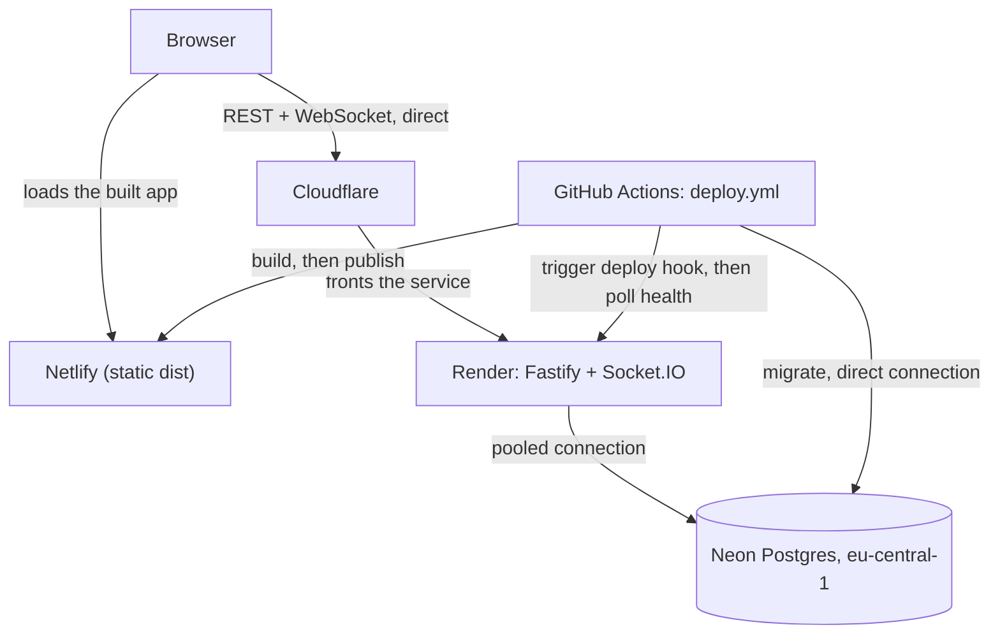

# Infrastructure

Wolfchatter runs in production: a static web app on Netlify, an API on Render, and Postgres on
Neon, deployed by a GitHub Actions workflow that runs after CI passes on `main`. This document
describes what is actually deployed and how it connects, the deploy pipeline and the traps it has
already hit, three **known gaps** that are documented rather than fixed, and two things that are
**designed but not built**: a staging environment and multi-instance scaling. Every section says
which category it's in; nothing below is running unless it says so.

## What is deployed, and how it connects



The browser talks to two origins directly, and Netlify is never in the middle of the second one:
it loads the static build from Netlify, and it calls the API's REST endpoints and opens its
WebSocket **directly against Render**. There is no proxy for that traffic because Netlify cannot
proxy WebSocket connections — routing through it was never an option to reject, there was nothing
to route through. Cloudflare fronts the Render service; that's Render's own infrastructure, not
something this project configured, and it's the reason `TRUST_PROXY` (below) has to trust an
entire CDN's worth of edge machines rather than one IP.

The API reaches Neon over its **pooled** connection for request-serving traffic. The deploy
workflow (and anyone running `pnpm db:migrate` by hand) reaches Neon over its **direct** connection
for migrations — Neon's own documentation recommends a direct connection for schema migrations,
for the same underlying reason a future realtime adapter would need one too (see "Multi-instance"
below).

| Piece | Where | Facts that matter |
|---|---|---|
| Web | Netlify, `https://wolfchatter.netlify.app` | Not linked to the repository; receives a pre-built `dist` only; `_redirects` serves the SPA on deep links; no deploy previews exist |
| API | Render free tier, `https://wolfchatter-api.onrender.com`, Frankfurt | Auto-Deploy **off**, deployed only by its hook; start command is plain `node apps/api/src/server.ts` because it runs on every wake from sleep |
| Database | Neon, `eu-central-1`, Postgres 17 | Pooled connection string for the API, direct connection string for migrations |
| Tiles | Stadia Maps | Domain registered; the access control that actually matters is a `Referer` check, not the registration — see "Stadia Maps" below and the PRD's corrected risk note |

## Environment, by provider

Every variable below is named, not valued, except where the value itself isn't a credential.

### Netlify (the web app)

Netlify holds no environment variable for this project. It only serves a pre-built `dist`
directory (decision D3 in `docs/plans/2026-09-16-m4-golive.md`), so the variable that actually
matters — `VITE_API_URL`, baked into the JavaScript bundle at build time — is set in the GitHub
Actions build step, not in Netlify.

### Render (the API)

| Variable | Value kind | Why |
|---|---|---|
| `DATABASE_URL` | Neon's **pooled** connection string, with `sslmode=verify-full` | The API's own request-serving queries; pooled because the API opens many short-lived connections rather than one long-lived session. That the value on Render really is the pooled string has not been re-checked since setup; see "The statement timeout may not be in effect in production" under Known gaps |
| `CORS_ORIGINS` | `https://wolfchatter.netlify.app` | The only browser origin allowed to call the API or open a socket |
| `TRUST_PROXY` | `loopback,uniquelocal` plus Cloudflare's published ranges (below) | Which hops' `X-Forwarded-For` are trusted for the client's real address |
| `LOG_LEVEL` | `info` | Pino's log verbosity |
| `COREPACK_ENABLE_DOWNLOAD_PROMPT` | `0` | Render's build installs pnpm through corepack; this silences an interactive download prompt that has no TTY to answer |
| `HOST` | left at `env.ts`'s own default, `0.0.0.0` | Not set explicitly; a container needs to accept connections on every interface, not just loopback |
| `PORT` | not set by this project; Render injects its own `PORT` automatically (`10000` by default) | `env.ts` already reads `process.env.PORT`, falling back to `3000` only when it's absent (local dev) — so Render's real value is used with no project-side configuration |
| `RENDER_GIT_COMMIT` | set automatically by Render, not configured here | `GET /api/health` reports it, which is what `wait-for-health.ts` polls for during a deploy |

### Neon (the database)

Two connection strings exist for the one database, and which one is used matters:

| Connection | Used by | Why that one |
|---|---|---|
| Pooled (`-pooler` host) | The API, on Render | Many short, concurrent requests — exactly what a pooler is for |
| Direct | `pnpm db:migrate`, run locally (against a fresh Neon project) and by the deploy workflow | Neon's docs recommend a direct connection for schema migrations, `LISTEN`/`NOTIFY`, and other session-scoped operations a pooled connection can't sustain (see "Multi-instance" below) |

Both strings carry `sslmode=verify-full` explicitly.

### Stadia Maps

Not an environment variable: a domain (`wolfchatter.netlify.app`) registered in Stadia's own
dashboard. Measured against the live tile server, registration turns out not to be what actually
gates a tile request — see the PRD's corrected risk note and the Gotchas in `CLAUDE.md`.

### GitHub Actions: secrets and variables

| Kind | Name | Holds | Why this kind |
|---|---|---|---|
| Secret | `DATABASE_URL` | Neon's **direct** connection string, `sslmode=verify-full`. Not the pooled one: the migration sends `lock_timeout` as a connection startup parameter, which Neon's pooler may drop or refuse | Grants full read/write access to the database |
| Secret | `RENDER_DEPLOY_HOOK_URL` | Render's deploy-hook URL | Anyone holding it can trigger a deploy |
| Secret | `NETLIFY_AUTH_TOKEN` | A Netlify auth token | Grants API access to the Netlify account; this workflow only uses it to publish |
| Variable | `API_ORIGIN` | `https://wolfchatter-api.onrender.com` | An origin, not a credential — and printing it in a deploy log is worth more than hiding it |
| Variable | `NETLIFY_SITE_ID` | The Netlify site's id | Identifies which site to publish to; grants nothing by itself |

Secrets hold values that grant access; variables hold values that don't. Splitting them this way
means a deploy log can print exactly which SHA, which API origin and which Netlify site were
involved — useful when a deploy fails — without printing anything that would help an attacker if
the log ever leaked.

### `TRUST_PROXY`, in full

This is the single most expensive value in the project to get wrong, and it is not a secret. Set
on Render, its value is:

```
loopback,uniquelocal,
173.245.48.0/20,103.21.244.0/22,103.22.200.0/22,103.31.4.0/22,141.101.64.0/18,
108.162.192.0/18,190.93.240.0/20,188.114.96.0/20,197.234.240.0/22,198.41.128.0/17,
162.158.0.0/15,104.16.0.0/13,104.24.0.0/14,172.64.0.0/13,131.0.72.0/22,
2400:cb00::/32,2606:4700::/32,2803:f800::/32,2405:b500::/32,2405:8100::/32,
2a06:98c0::/29,2c0f:f248::/32
```

(24 entries: `loopback` and `uniquelocal`, plus Cloudflare's 15 IPv4 and 7 IPv6 ranges, fetched
from `cloudflare.com/ips-v4` and `/ips-v6` on 2026-09-16 to write this document — the same source
this value must be checked against going forward.)

**Why it has to be this wide.** Render fronts every service with Cloudflare. Without trusting
Cloudflare's ranges, Fastify's `trustProxy` sees Cloudflare's edge machine as the client, `req.ip`
resolves to whichever edge answered a given connection, and every real visitor on the internet
shares a handful of per-edge rate-limit buckets — two strangers would throttle each other, and an
attacker rotating across edges gets a multiple of the intended limit. Neither failure raises an
error; both are silent.

**How it was derived.** Not guessed, and not on the first try: `uniquelocal` alone (from Render's
own health-checker traffic) and `loopback` alone (from one instance's peer address) each looked
right against one measurement and broke on the next real request or the next deploy. The value
that finally settled it came from Fastify's request log, which serialises `remoteAddress: req.ip`
— rate-limit headers are a side effect of that same value and cannot name it, which is why two
earlier attempts read them instead and drew the wrong conclusion. Full account:
`worklog/2026-09-16T0633-three-trust-proxy-values-before-the-request-log-gave-the-rig.md`.

**Maintenance.** Cloudflare's ranges change. The list above must be checked against
`https://www.cloudflare.com/ips-v4` and `https://www.cloudflare.com/ips-v6` periodically — there
is no alert for drift. The symptom of a stale list is not an error; it's a silent return to
per-edge buckets, which looks like nothing until two unrelated users start throttling each other.

### `DATABASE_URL` and `sslmode=verify-full`

Every deployed `DATABASE_URL` — Render's pooled string, the GitHub secret's direct string, and any
direct connection run by hand against Neon — carries `sslmode=verify-full` explicitly, and
`apps/api/src/env.ts` refuses to start the API without it once the host isn't loopback. Two
sentences why: `pg` currently treats Neon's `sslmode=require` as an alias for `verify-full` and
verifies the certificate chain, but after `pg-connection-string` v3 and `pg` v9 the same string
will mean libpq's unverified `require` — encrypt the connection, verify nothing. Spelling out
`verify-full` today is identical behaviour and survives that change silently, instead of a future
dependency bump downgrading production TLS with no error and no failing test.
(`worklog/2026-09-16T0555-pg-treats-sslmode-require-as-verify-full-until-it-doesn-t.md`.)

## The deploy pipeline

`.github/workflows/deploy.yml` runs after CI succeeds on a push to `main` (`workflow_run`), or on
demand (`workflow_dispatch`). Its ordering rule: every step that cannot change production runs
before the first step that can, so a failure in one of them leaves production exactly as it was.
Its steps, in order, and why each is where it is:

1. **Resolve the commit to deploy** — `github.event.workflow_run.head_sha`, falling back to
   `github.sha` only for a manual `workflow_dispatch` run, which has no `workflow_run` event to
   read a `head_sha` from.
2. **Check out that commit with full history** (`fetch-depth: 0`) — the web build resolves each
   work-log entry's commit from `git log` (`apps/web/plugins/worklog.ts`), and a shallow clone
   would silently ship a devlog with no commit links.
3. **Build the web app** — `VITE_API_URL` is baked into the bundle at build time from the
   `API_ORIGIN` variable. Built now, not after the API deploy, so a build failure changes nothing.
4. **Resolve the Netlify CLI** — the publish step's exact `pnpm dlx` command with `--version` in
   place of `deploy`, and no secrets in its environment, because this is where the CLI's install
   scripts run. `pnpm dlx` has no lockfile and resolves the CLI's whole dependency tree on every
   run, so this surfaces a resolution or install failure before production changes; the publish
   step then reuses the install from pnpm's dlx cache. It cannot catch a mistake in `deploy`'s own
   arguments: `--version` never reads `--dir`, which is how the defect under "Traps" below got as
   far as it did.
5. **Migrate the database** — against Neon's direct connection, the first step that changes
   production. This runs while the *previous* commit's API is still serving live traffic, which is
   what forces the backward-compatibility rule below.
6. **Trigger the Render deploy hook** — a `POST`; a `2xx` only proves Render *accepted* the
   request, not that anything shipped.
7. **Wait for `/api/health` to report the new commit** — the only real evidence a deploy
   happened. It requires both `ok: true` and the matching commit; a `503` or a stale commit both
   keep it polling, up to a 10-minute timeout that fails naming both the expected commit and the
   last one it saw. Each attempt is abandoned after 60 seconds, or sooner if less of the timeout is
   left, so a connection that never answers cannot hold the wait past it. The job's own 20-minute
   timeout sits above that on purpose, so a slow deploy fails with this step's descriptive error
   rather than GitHub's generic "job timed out". No other step has a timeout of its own: a hang in
   checkout, install, the build, the CLI warm-up or the migration still ends in that generic job
   timeout.
8. **Publish to Netlify** — last, because by then the API it will talk to is confirmed live. The
   rehearsal below found that "last" still wasn't safe enough on its own.

### Traps this workflow has already hit

- **`github.sha` is not the deployed commit.** In a `workflow_run` event, `github.sha` is the
  default branch's *current* tip at the moment the job starts, not the commit whose CI run
  triggered it — if a second commit lands on `main` while the deploy is queued, `github.sha` would
  point at that instead, and the health check would compare against the wrong SHA. The workflow
  resolves `github.event.workflow_run.head_sha` instead.
- **A feature branch cannot rehearse this workflow.** `workflow_dispatch` and `workflow_run` both
  require the workflow file to already exist on the **default branch** — a trap the plan's
  decision D8 identified for the automatic trigger, and D9 wrongly assumed the manual trigger
  escaped (D9 is struck through in `docs/plans/2026-09-16-m4-golive.md` rather than rewritten).
  There is no way to trigger `deploy.yml` from a feature branch before merging. It was rehearsed
  instead by hand, against the real providers, with Render temporarily pointed at the branch
  (`worklog/2026-09-16T1522-the-deploy-rehearsed-by-hand-and-the-step-it-would-have-fail.md`) —
  but not every step. The health poll, the build and the publish ran their real commands in the
  workflow's order; the API was deployed from Render's dashboard, not through the hook; and the
  **migrate step did not run at all**. `pnpm db:migrate` last ran against Neon at setup, from a
  laptop, with the direct string, before the TLS rule in `apps/api/src/env.ts` existed. The
  rehearsal's cold-start check was skipped too: "Waking up the server…" is covered by an
  end-to-end test that delays the first connection (`apps/web/e2e/realtime.spec.ts`), but has not
  been watched on a genuinely slept instance. So the first automatic deploy is the first run of:
  - the workflow's own plumbing: the `workflow_run` trigger and its guard, the SHA resolution,
    and the checkout;
  - the `DATABASE_URL` secret, and so its first meeting with the TLS rule;
  - the `RENDER_DEPLOY_HOOK_URL` secret, which the rehearsal did not call;
  - probably the `NETLIFY_AUTH_TOKEN` secret, since the rehearsal published from a machine whose
    Netlify CLI was already logged in;
  - `pnpm dlx` and its `--allow-build` list on Linux, which have only run on macOS;
  - the CLI warm-up step and the build-before-migrate order, and the
    `$GITHUB_WORKSPACE/apps/web/dist` spelling of `--dir` (below), all added after the rehearsal.

  All of them ran on 2026-09-17, in the automatic deploy of the merge commit `c097753` (run
  35187218562), and all passed in 1 m 25 s. Render's Events show exactly one deploy for that
  commit, via the hook. The same morning, the cold start was watched on the live site: "Waking up
  the server…" at 3.9 seconds, connected at 35.4 seconds. Still unexercised: the fork and
  failed-CI guards, a `head_sha` that differs from the branch tip, and rollback.
- **A `200` from the deploy hook proves nothing.** Render answers the hook before the build even
  starts. The health poll afterward is the only evidence, and it requires both `ok: true` and the
  matching commit — a well-formed `503` reporting the right commit still means the API can't
  actually serve a request. An earlier version of this check accepted that case by mistake; a
  reviewer caught it before it shipped.
- **Changing a Render service's branch does nothing by itself.** With Auto-Deploy off, pointing
  the service at a different branch in Render's dashboard deploys nothing until a Manual Deploy is
  triggered — observed directly during the rehearsal, where `/api/health` kept reporting `main`'s
  commit after the branch was switched.
- **The Netlify CLI resolves `--dir` against the repository root, not the working directory.** Run
  from `apps/web` exactly as the workflow specifies, `netlify deploy --dir dist` failed with
  `Deploy path: <repository root>/dist`. The same command with an absolute `--dir "$PWD/dist"`,
  still run from `apps/web`, published in 13 seconds. The workflow spells that same directory
  `$GITHUB_WORKSPACE/apps/web/dist`, which does not depend on the working directory at all; that
  spelling first ran in the first automatic deploy, and published. This was the one defect
  that survived an implementer, a task review and a scoped re-review, because every earlier check
  confirmed the pinned CLI with `--version` — a flag `--dir` never touches (`f43330a`;
  `worklog/2026-09-16T1518-a-command-verified-with-version-was-not-the-command-that-run.md`).
  `working-directory: apps/web` still matters for a separate reason: run from the repository root,
  the CLI's own workspace detection asks an interactive question with no TTY to answer, and
  crashes.
- **`drizzle-kit generate` can exit `0` on failure.** A column rename needs its interactive
  "rename, or drop and add?" prompt; with no TTY it prints an error and generates nothing, but
  still exits `0`. CI's drift check (`ci.yml`) reads the command's combined output for a
  recognized success line and rejects any `Error:` line, rather than trusting the exit code alone.
- **A fork's own CI run could reach the secrets-bearing job.** This repository is public, and
  `workflow_run.branches: [main]` filters on `head_branch` — which, for a fork's own pull-request
  run, is a branch name *inside the fork*. A fork branch named `main` would satisfy that filter
  alone. The guard also checks
  `github.event.workflow_run.head_repository.full_name == github.repository`, and
  `github.event.workflow_run.event == 'push'`, so only a CI run that a push to this repository's
  own `main` started can start the job.

### Migrations run before the API deploys

The migration step runs against the database the *previous* commit's API is still serving live
traffic from — a free-tier build and boot takes minutes, and the old instance keeps answering
requests the whole time. Every migration must therefore be backward compatible with the code still
running: additive changes (a new nullable column, a new table) are safe; a rename or a drop that
the old code still reads is not, and needs an expand/contract pair across two deploys instead of
one.

A migration also must not stall that live traffic. Postgres queues every later request for a
conflicting lock behind a statement that is waiting for one, so a migration blocked on a lock
would hold up even plain reads from the running API. The migration connection therefore has no
statement timeout, since a migration may legitimately run for minutes, but a 2-second lock timeout:
a migration that cannot get its lock fails with `55P03` and applies nothing, before the API is
deployed (`MIGRATION_LOCK_TIMEOUT_MS` in `apps/api/src/db/migrations.ts` says why 2 seconds).

**Worked example — renaming `rooms.lat` to `rooms.latitude`:**

1. Deploy 1 (expand): add `latitude` as a new column. The running code keeps reading and writing
   `lat` only. A backfill (`UPDATE rooms SET latitude = lat`) copies existing rows once the column
   exists.
2. Deploy 2 (contract): ship code that reads and writes `latitude` only. A later migration drops
   `lat` once nothing depends on it.

Two deploys, not one: the migration in deploy 1 must not break the code still running from before
it shipped, and the code in deploy 2 must not go live before its own migration has already added
the column it expects.

### Rollback

Each piece rolls back independently. **None of this has been exercised** — these are procedures
that exist on paper, not ones that have been run for real.

- **Render:** Manual Deploy → Deploy a specific commit, pointing at the last commit
  `wait-for-health.ts` confirmed as live.
- **Netlify:** the dashboard keeps every previous deploy; publishing an older one replaces the
  live site immediately.
- **Database:** a migration is not simply undone. This project's migrations are forward-only —
  `drizzle-kit generate` produces no down script. The backstop is Neon's point-in-time restore,
  which can roll a branch back to any point inside the project's history window (6 hours on
  Neon's free plan, longer on paid plans). That backstop is the reason migrations stay
  forward-only and additive: a real rollback here means restoring data, not reversing a schema.

## Known gaps — documented, not fixed

Three weaknesses the final M4 review found and M4 deliberately leaves in place, each for M5. None
of them has been observed in production.

### The deploy hook builds `main`'s tip, not the commit that was migrated

**The gap.** `deploy.yml` calls Render's deploy hook without naming a commit, so Render builds
whatever is at the tip of `main` when its build starts — not necessarily the commit whose
migrations the step before just applied.

**What triggers it.** Two merges to `main` within a few minutes, so the second lands before
Render starts the build the first one asked for.

**What happens.** Deploy A migrates for A and calls the hook; Render builds B. A's health wait
never sees A's commit and fails after ten minutes, without publishing A's web app. Meanwhile B's
API is live without B's migrations until deploy B, queued behind A, gets to its own migrate step;
any request of B's that needs one of them fails in that window.

**The fix.** Render's deploy hooks accept a `ref` query parameter naming the commit to deploy, so
the hook could ask for exactly the resolved SHA. Deferred because it has not been tested against
this service: Render answers an invalid `ref` with a `400`, and a mistake there would break the
first automatic deploy after the database had already migrated.

### The statement timeout may not be in effect in production

**The gap.** `apps/api/src/db/client.ts` gives the API's pool a 5-second `statement_timeout`, which
`pg` sends as a connection startup parameter. Render's `DATABASE_URL` is meant to be Neon's pooled
string, and Neon's pooler is PgBouncer, which by default refuses a connection whose startup packet
carries a parameter it cannot track, and ignores such a parameter only when configured to.
`statement_timeout` cannot be tracked: PgBouncer can only track parameters Postgres reports back
to the client. The live API connects and is healthy, so either Render's `DATABASE_URL` is not the
pooled string, or the pooler drops the parameter and the 5-second timeout exists only in tests and
local development. Which of the two is true has not been checked.

**What triggers it.** Any statement that runs long in production, such as a bad query plan or a
long wait for a lock.

**What happens.** If the parameter is dropped, nothing cancels that statement: it holds its pooled
connection for as long as it runs, which is exactly what the timeout exists to prevent.

**How to check.** See whether the host in Render's `DATABASE_URL` contains `-pooler`. Then run
`SELECT current_setting('statement_timeout')` through `connectDatabase` with that same URL: `5s`
means the timeout reaches Postgres, `0` means it was dropped on the way.

**The fix, if it is dropped.** Set it on the database role, `ALTER ROLE … SET statement_timeout =
'5s'`, which Postgres applies itself whatever the pooler forwards. The migration connection
(`connectForMigrations`, used by `migrate.ts`) would then have to issue `SET statement_timeout = 0`
explicitly, which its direct connection allows: today migrations run without a statement timeout
only because they never send the parameter, and a role default would give them 5 seconds whenever
they connect as that role.

### `TRUST_PROXY` can be forged from inside Cloudflare's ranges

**The gap.** `TRUST_PROXY` trusts every Cloudflare range, and Fastify treats every trusted address
in `X-Forwarded-For` as one more proxy, taking the first untrusted address from the right as the
client. A Cloudflare Worker that requests a site on another Cloudflare-hosted domain arrives from
`2a06:98c0:3600::103`, which is inside the trusted `2a06:98c0::/29`, and a Worker can set its own
`X-Forwarded-For` on that request. The API would skip the Worker's address as a trusted proxy and
key the rate limiter on whatever address the Worker wrote.

**What triggers it.** A free Cloudflare Workers account and a few lines of script. This is reasoned
from Cloudflare's documented behaviour and was **not** tested against the live service. The
experiments that settled the current value tested an ordinary client adding a forged header,
which cannot pick its bucket
(`worklog/2026-09-16T0633-three-trust-proxy-values-before-the-request-log-gave-the-rig.md`).

**What happens.** The caller chooses its own rate-limit bucket on every request, so the limits of
10 chatroom creates and 30 messages a minute stop applying to it.

**The fix.** Key the limiter on `CF-Connecting-IP`, if Render passes that header through to the
API — measure it in the request log first, the way `TRUST_PROXY` itself was settled — or trust at
most one Cloudflare hop instead of any number of them. Even as it stands, the value is a large
improvement on an untrusted proxy, where every visitor shared a handful of per-edge buckets.

## Free-tier realities

| Piece | Limit | Consequence |
|---|---|---|
| Render (API) | Free web services spin down after 15 minutes with no inbound traffic; Render's own docs estimate about a minute to restart one | Measured against this API three times: **33 seconds** twice, then **35 seconds** on the live site on 2026-09-17, where the first request hit its 30-second deadline and a retry loaded the chatrooms. The web app shows "Waking up the server…" during this, and every request carries a 30-second deadline |
| Render (account) | 750 free instance hours a month, shared across every free service on the account | Once exhausted, free services are suspended until the next month |
| Neon | Compute suspends after 5 minutes of inactivity on the free plan and can't be disabled there; the next query resumes it | Not measured separately: `/api/health` queries the database directly, so the measured 33–35-second Render cold start already includes any time Neon's compute needed to wake |

A single 30-second request deadline can't by itself span a slept instance's wake — the number that
actually has to cover it is that deadline combined with the query client's existing retry policy.
Traced from `@tanstack/query-core`'s retryer and confirmed by timing the real library
(`apps/web/src/api/client.ts`): a mutation makes 3 attempts across 93 seconds, a query makes 4
across 127 seconds, both comfortably past a 33–35-second wake. A mutation shows "Sending…" for the
whole sequence, not a flicker of failures, because TanStack Query's own status doesn't change
between internal retries.

**What a paid tier would change, without recommending one.** A paid Render instance does not
sleep, which removes the cold start and the 750-hour cap entirely. A paid Neon plan can disable
scale-to-zero, keeping compute always on, and extends the point-in-time restore window well past
6 hours. Neither is used here — the PRD scopes this as a demo-level deployment, and the free tiers
are what it is built and measured against.

## Staging — designed, not built

No staging environment exists; everything above describes production only. Building one would
need:

- A second Render service on its own branch, Auto-Deploy handled the same way production is —
  off, driven by its own deploy hook (or a second workflow gated on that branch).
- A **Neon branch**, copy-on-write from production: staging starts from the real schema without
  copying any data, and only diverges as staging's own migrations run against it.
- A Netlify branch deploy, or a second site, serving the staging build.
- That origin added to the staging API's own `CORS_ORIGINS` — never to production's.
- The staging domain registered with Stadia Maps, the same one-time step already done for
  production.
- GitHub environments with protection rules: staging deploys automatically on green CI, the way
  production does today; production instead requires a manual approval before the deploy job runs.

**Why this project has no deploy previews (plan decision D4).** The obvious alternative — a
preview URL per pull request, with `deploy-preview-*.netlify.app` added to `CORS_ORIGINS` — was
rejected because Netlify cannot proxy WebSockets: a preview would still talk to the *production*
API and the *production* database, from an origin that would have to be wildcard-allowlisted to
work at all, since `deploy-preview-*` is not one fixed string. Deleting the possibility of a
preview origin was cheaper than guarding one that talks to production data.

## Multi-instance — designed, not built

Exactly one API instance runs today. Running more than one would need:

- **Real-time fan-out.** Socket.IO's default in-memory adapter only reaches clients connected to
  the *same* process, so events would need `@socket.io/postgres-adapter` to share `room:created`
  and `message:created` across instances over Postgres `LISTEN`/`NOTIFY`, as PRD §4 plans, instead
  of adding Redis.

  **One constraint the PRD does not mention, and this deployment makes concrete: Neon's pooled
  connection cannot hold a `LISTEN`.** Verified against Neon's own documentation
  (`neon.com/docs/connect/connection-pooling`, checked 2026-09-16): Neon's pooler runs PgBouncer in
  **transaction mode** (`pool_mode=transaction`), which returns a connection to the pool as soon as
  each transaction completes. The same page lists `LISTEN / NOTIFY` under "Not supported with
  pooled connections" for exactly that reason — a `LISTEN` has to persist on one held connection,
  and transaction mode never holds one past a transaction's end — and recommends a direct
  connection for it, the same recommendation that already governs this project's migrations
  (above). `@socket.io/postgres-adapter` would need a direct connection of its own, separate from
  the pooled one the rest of the API uses.
- **No sticky sessions needed.** The client uses WebSocket transport only, with no long-polling
  fallback, so a load balancer never has to keep a client pinned to one instance the way Socket.IO's
  HTTP long-polling transport would require.
- **Rate limiting does not survive the jump.** `@fastify/rate-limit` counts in the process's own
  memory. N instances behind a load balancer means N independent counters, so a client can reach up
  to N times the configured limit before any single counter would have stopped it — fixed only once
  the counter moves to a shared store.
- **Migrations already do the right thing.** They run once, from the GitHub Actions workflow,
  never per instance. Nothing changes here.
- **The `room:join` cap holds unchanged.** It's enforced per socket
  (`MAX_JOINED_ROOMS_PER_SOCKET` in `apps/api/src/realtime/socket-server.ts`), so it holds per
  connection regardless of which instance that connection lands on.

## What needs maintaining

- **`TRUST_PROXY`'s Cloudflare ranges** (above) — last checked against `cloudflare.com/ips-v4` and
  `/ips-v6` on 2026-09-16. Drift here doesn't error; it silently returns rate limiting to shared,
  per-edge buckets.
- **The pinned `netlify-cli@27.7.0`** in `deploy.yml` — bumping the CLI itself is a deliberate
  edit, but the pin does not freeze what runs. `pnpm dlx` has no lockfile and re-resolves the CLI's
  whole dependency tree on every run, so a transitive dependency can change underneath the pin. The
  deploy's CLI warm-up step (step 4 above) is the mitigation: it resolves and installs that tree
  before production changes, so a change that breaks resolution or installation fails the deploy
  first. A change that only alters what `deploy` does would still surface at the publish step. And
  `--version` resolving is not evidence that `--dir`/`--package`/`--allow-build` still behave the
  same way on a new version
  (`worklog/2026-09-16T1518-a-command-verified-with-version-was-not-the-command-that-run.md`).
- **The Stadia Maps domain registration** — tied to `https://wolfchatter.netlify.app`; a future
  domain change needs re-registering there too.
- **Node 24 via `.nvmrc`** — read by `actions/setup-node` in both workflows; bump it in one place.
